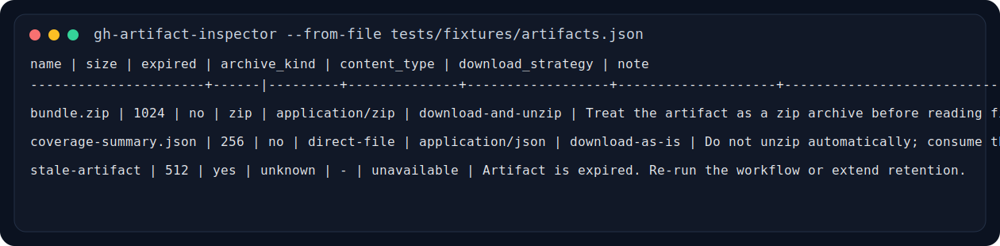

# gh-artifact-inspector

[](https://github.com/JD114514-CPU/gh-artifact-inspector/actions/workflows/ci.yml)

一个面向 GitHub Actions artifact 的小型诊断 CLI，目标是尽快回答一个常见问题：

“这个 artifact 到底该直接消费，还是应该先当 zip 解压？”

## 目标用户

- 维护 GitHub Actions workflow 的开发者
- 需要排查 artifact 下载兼容性问题的工程师
- 想把 run / artifact 元数据结构化输出给脚本或 agent 的用户

## 当前已实现的 MVP

- 读取 GitHub Actions `run_id` 的 artifact 列表
- 支持直接读取离线 JSON payload，方便复盘或写测试
- 输出 `name / size / expired / archive_kind / content_type / download_strategy / note`
- 支持终端表格输出、`--json`、`--json-report`、`--markdown` 和 `--markdown-report`
- 支持 `--strict`，可在 CI / agent 流程里把“人工确认”升级成非零退出码
- 对疑似 `direct-file` artifact 明确提示“不要自动 unzip”

## 为什么值得做

- 方向贴近 GitHub workflow / 开发者工具链，适合简历上的“工程效率工具”
- 范围小，能快速演示“从真实痛点到可运行 CLI”的落地能力
- 今天在 `cli/cli#13012` 对应的问题背景下，这个需求是明确存在的

## 安装和运行

```bash
git clone https://github.com/JD114514-CPU/gh-artifact-inspector.git
cd gh-artifact-inspector
uv sync --group dev
uv run gh-artifact-inspector --from-file tests/fixtures/artifacts.json
```

如果只想快速试跑，不想先同步开发依赖：

```bash
cd gh-artifact-inspector
set PYTHONPATH=src
python -m gh_artifact_inspector.cli --from-file tests/fixtures/artifacts.json
```

如果要直接读取 GitHub API：

```bash
gh-artifact-inspector --repo owner/name --run-id 123456789
```

也可以直接贴 workflow run URL：

```bash
gh-artifact-inspector --run-url https://github.com/owner/name/actions/runs/123456789
```

如果同时传 `--run-url` 和 `--repo` / `--run-id`，工具会校验两者是否一致，避免静默读错 run。

私有仓库或更高 rate limit 建议设置：

```bash
set GITHUB_TOKEN=your_token_here
gh-artifact-inspector --repo owner/name --run-id 123456789 --probe-download --json
```

如果要把结果直接贴进 issue、PR 或日报：

```bash
gh-artifact-inspector --from-file tests/fixtures/artifacts.json --markdown
```

如果 agent、脚本或 CI 需要同时拿到汇总结论和明细列表：

```bash
gh-artifact-inspector --from-file tests/fixtures/artifacts.json --json-report
```

如果想直接生成一段更完整的 Markdown 报告，包含来源和汇总要点：

```bash
gh-artifact-inspector --from-file tests/fixtures/artifacts.json --markdown-report
```

如果要把它接进 CI 或 agent 流程，遇到过期 artifact 或无法自动判断包装形式时直接失败：

```bash
gh-artifact-inspector --repo owner/name --run-id 123456789 --probe-download --strict
```

`--strict` 会保持正常输出，但在以下场景返回退出码 `2`：

- artifact 已过期
- artifact 仍需要人工确认包装形式

## 输出示例

```text
name                  | size | expired | archive_kind | content_type     | download_strategy | note
----------------------+------|---------|--------------|------------------|-------------------|---------------------------------------------------------------
bundle.zip            | 1024 | no      | zip          | application/zip  | download-and-unzip| Treat the artifact as a zip archive before reading files.
coverage-summary.json | 256  | no      | direct-file  | application/json | download-as-is    | Do not unzip automatically; consume the downloaded file directly.
stale-artifact        | 512  | yes     | unknown      | -                | unavailable       | Artifact is expired. Re-run the workflow or extend retention.
```

README 可直接渲染的终端截图素材：



真实跑出来的表格输出已保存到 [examples/demo-output.txt](examples/demo-output.txt)，可直接作为后续 README 截图或发布素材。
Markdown 版本示例输出已保存到 [examples/demo-output.md](examples/demo-output.md)，方便直接复用到 GitHub 文本场景。
Markdown 报告版本示例已保存到 [examples/demo-report.md](examples/demo-report.md)，方便直接贴进 issue、PR 或日报。
JSON 报告版本示例已保存到 [examples/demo-report.json](examples/demo-report.json)，方便直接给 agent、脚本或 CI 消费。
真实联网 `--probe-download` 示例已保存到 [examples/live-probe-report.md](examples/live-probe-report.md)，用于展示 direct-file artifact 的真实诊断。

## 本地验证

```bash
uv run python -m pytest
```

## 仓库素材

- 示例输入：`tests/fixtures/artifacts.json`
- 真实 demo 输出：`examples/demo-output.txt`
- README 截图素材：`examples/demo-output.svg`
- JSON 报告示例：`examples/demo-report.json`
- 真实联网 probe 示例：`examples/live-probe-report.md`
- 许可证：`LICENSE`
- 建议仓库 topics：`github-actions`、`artifacts`、`cli`、`devtools`、`workflow-debugging`
- 当前公开 release：`v0.1.0`

## 当前公开状态

- 仓库：`https://github.com/JD114514-CPU/gh-artifact-inspector`
- release：`https://github.com/JD114514-CPU/gh-artifact-inspector/releases/tag/v0.1.0`
- CI：`https://github.com/JD114514-CPU/gh-artifact-inspector/actions/workflows/ci.yml`
- 真实 probe run：`https://github.com/JD114514-CPU/gh-artifact-inspector/actions/runs/29322701009`
- README 已包含可直接渲染的 CLI demo 截图素材

## 发布后建议

- 如果后续要打到 PyPI，再补 `project.urls` 里的文档或 changelog 链接

## 下一步

- 支持最近 N 次 run 的批量扫描
- 增加一个“兼容下载器”示例脚本
